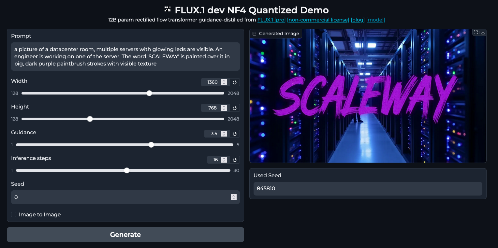

FLUX.1 dev NF4 Quantized Demo
=============================

This demo run on a L4 GPU and use fully loaded in VRAM around 17GB.




Prerequisites
-------------

- Scaleway L4 GPU instance with GPU OS
- python3.10-venv package

To install
----------

```
git clone https://github.com/n-Arno/flux-dev-demo.git
cd flux-dev-demo
./install.sh
```

To run
------

```
cd flux-dev-demo
./run.sh
```

Navigate to `http://<instance-ip>:8000`

There is currently no authentification, leverage VPC + a Loadbalancer (and ACL) or Security Groups to restrict access.

Credits
-------

Adapted from: https://huggingface.co/spaces/nyanko7/flux1-dev-nf4/tree/main
License: mit
